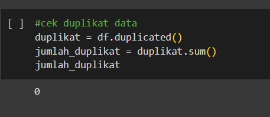
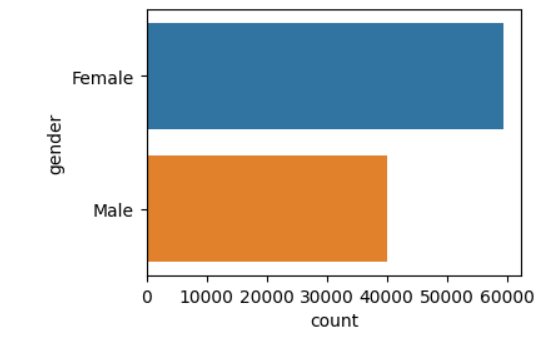
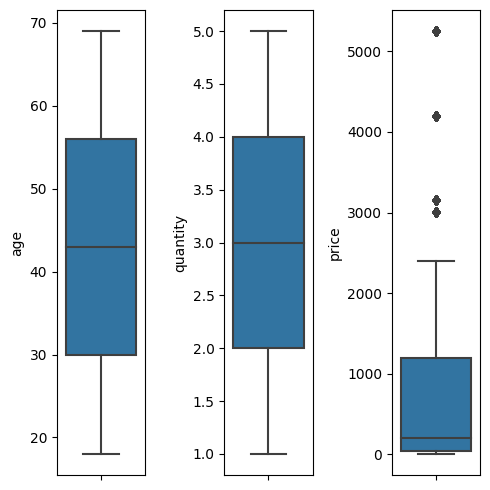

# Analyst, Visualization, and Clustering (K-means) on Retail Dataset
Dalam proyek ini, kami menyajikan analisis, visualisasi, dan pengelompokan data ritel menggunakan algoritma K-means. Tujuan utama kami adalah memahami pola dan tren dalam dataset ritel ini, sehingga memberikan wawasan berharga bagi industri ritel.

## Technologies
- Python
- Pandas 
- jupyter
- numpy
- matplotlib
- seaborn
- google colab

## Pre-Procesing
### 1. Problem Statement
memahami banyaknya karakteristik pelanggan dan perilaku pelanggan serta preferensi mereka menjadi penting untuk mengoptimalkan strategi pemasaran dan pengambilan keputusan yang efektif.

### 2. Dataset

### 3. Missing Value

tidak adanya data yang missing, sehingga tidak perlu ada tindakan lebih lanjut.

### 4. Duplicate Data

Tidak terdapat data yang duplikat sehingga tidak perlu adanya tindak lanjutan.

## Visualization and Analyst
### 1. Customer Age Distribution

Distribusi usia pelanggan cenderung terkonsentrasi di rentang 25-65 tahun. Perhatikan bahwa kelompok usia di bawah 25 tahun memiliki frekuensi yang lebih rendah, sementara kelompok usia di atas 65 tahun juga menunjukkan penurunan frekuensi.

Rekomendasi: Fokus pada strategi pemasaran untuk menarik pelanggan muda dan mengembangkan program loyalitas untuk pelanggan berusia di atas 60 tahun.

### 2. Quantity Distribution

Perhatikan bahwa jumlah penjualan tiap quantity memiliki nilai yang hamper sama banyak, tidak ada kenaikan ataupun penurunan.

Rekomendasi : tidak ada rekomendasi yang dapat di ambil berdasarkan quantity karena nilainya sama banyak cukup rata.

### 3. Relationship Between Age and Price

Tidak ada korelasi yang jelas antara usia pelanggan dan harga produk yang dibeli.

Ada variasi yang signifikan dalam harga produk yang dibeli oleh pelanggan dalam rentang usia yang sama.

Rekomendasi: Tidak ada rekomendasi khusus berdasarkan hubungan usia dan harga, namun perlu memperhatikan strategi penetapan harga dan menawarkan pilihan produk yang beragam.

### 4. Gender Category Frequency

Kategori Female memiliki frekuensi lebih tinggi dari pada Male.

Rekomendasi : fokue terhadap Kategori Male untuk meningkatkan daya beli kategori Male

### 5. Product Category Frequency

### 6. Payment Method Category Frequency

Kategori metode pembayaran dengan frekuensi tertinggi adalah Cash, dikuti dengan Credit Card dan Debit Card.

Rekomendasi : fokus untuk memberikan diskon dengan metode pembayaran Debit Card, agar dapat meningkatkan daya beli pengguna Debit Card.

### 7. Shopping Mall Category Frequency

Mall dengan frekuensi tertinggi adalah Mall of Istanbul dan Kanyon. Mall dengan frekuensi terendah adalah Emar Square.

Rekomendasi : fokus untuk pemasaran di Mall dengan frekuensi rendah untuk meningkatkan daya beli di mall tersebut.

## Handling Outlier

Kolom price memiliki outlier yang cukup jauh, dan dapat menurunkan peforma model, sehingga akan di imputasi outlier.

## Cluster Analyst

### 1. Elbow Method

Berdasarkan analisis kluster menggunakan metode K-means, pelanggan dapat dikelompokkan menjadi 3 kluster yang berbeda.

### 2. Cluster Frequency

Kluster 0 memiliki frekuensi tertinggi, diikuti oleh Kluster 2 dan Kluster 1.

Rekomendasi: Menyesuaikan strategi pemasaran dan penawaran produk untuk masing-masing kluster guna memaksimalkan penjualan dan kepuasan pelanggan.

### 3. Cluster Characteristics

Kluster 0: Pelanggan dalam kluster ini cenderung berusia muda, memiliki kuantitas pembelian yang tinggi, dan harga produk yang relatif rendah. 
Rekomendasi: Mengembangkan program loyalitas untuk mempertahankan pelanggan dalam kluster ini, serta menawarkan paket produk dengan harga yang lebih mahal.

Kluster 1: Pelanggan dalam kluster ini berusia relatif beragam, memiliki kuantitas pembelian sedikit, membeli produk dengan harga tinggi. 
Rekomendasi: Menargetkan kampanye pemasaran yang mengandalkan gaya hidup aktif, menawarkan diskon berbasis kuantitas, dan memperluas variasi produk yang tersedia.

Kluster 2: Pelanggan dalam kluster ini cenderung berusia lebih tua, memiliki kuantitas pembelian yang cukup tinggi, dan cenderung memilih produk dengan harga 
rendah. 
Rekomendasi: memberikan kampanye untuk membeli produk premium demi kenyamanan dan kualitas produk
